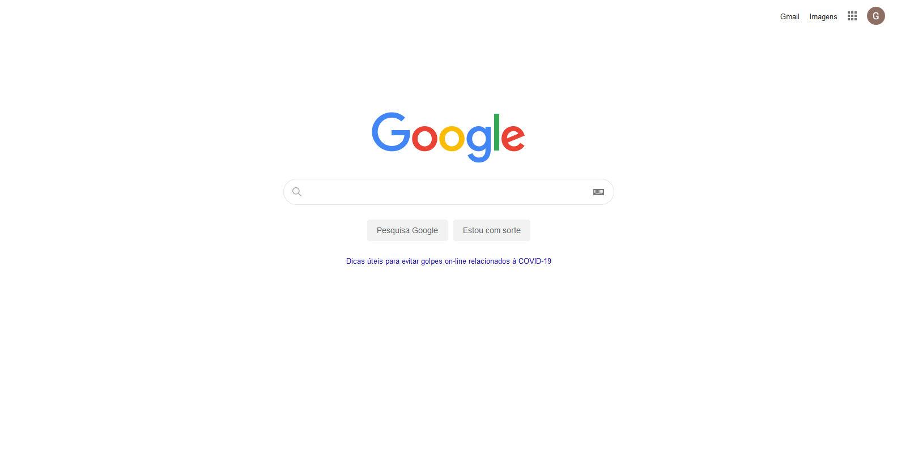

#### 📒   _Always learn_

# Google home page clone
Project created in order to exercise my knowledge in HTML5 and CSS3.

`Web preview`

## Deployment in
https://devgabrieldejesus.github.io/google-clone/

## Release history

* 0.0.2
    * Finished project and studying the possibility of adding `new resources`
* 0.0.1
    * Work in `progress`

## Meta

Gabriel de Jesus – [My portfolio](https://gabrieldesenvolvedor.com/) – oi@gabrieldesenvolvedor.com

Distributed under the MIT License. See `LICENSE` for more information.

[https://github.com/devgabrieldejesus/google-clone](https://github.com/devgabrieldejesus/)

## Contributing

1. Fork it (<https://github.com/devgabrieldejesus/google-clone/fork>)
2. Create your feature branch (`git checkout -b feature/fooBar`)
3. Commit your changes (`git commit -am 'Add some fooBar'`)
4. Push to the branch (`git push origin feature/fooBar`)
5. Create a new Pull Request
